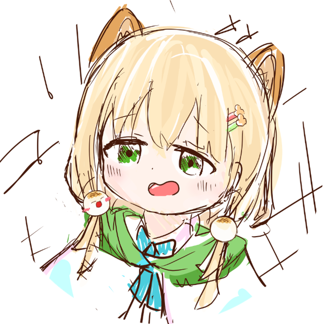
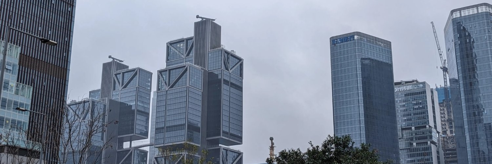

*＼もきゅッッ／*

    

## 👀 くろえいさんについて

電子情報工学を学ぶ高専4年生です．あんまりプログラミングできません．

## ✈️ 渡航経験

1. 台湾
2. 香港
3. 深圳

*Taken in 南山, 深圳 on March 1, 2024*

## 💻 デバイス

- HONOR MagicBook Art 14
- Google Pixel 8
- iPad Air (5th generation)

## 🔗 リンク

- [くろえいさんのサイト](https://kuroyei.com/)
- [Twitter](https://x.com/kuroyei)
- [Instagram](https://www.instagram.com/kuroyei_san_desu)
- [Zenn](https://zenn.dev/kuroyei)
- [GitHub](https://github.com/kuroyei)

<!--
**kuroyei/kuroyei** is a ✨ _special_ ✨ repository because its `README.md` (this file) appears on your GitHub profile.

Here are some ideas to get you started:

- 🔭 I’m currently working on ...
- 🌱 I’m currently learning ...
- 👯 I’m looking to collaborate on ...
- 🤔 I’m looking for help with ...
- 💬 Ask me about ...
- 📫 How to reach me: ...
- 😄 Pronouns: ...
- ⚡ Fun fact: ...
-->
